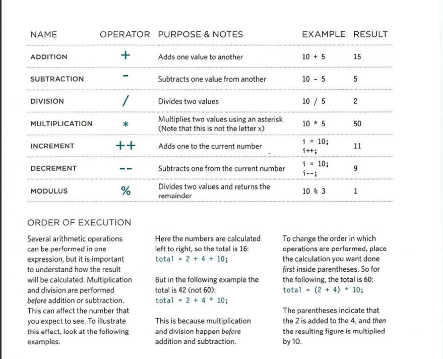
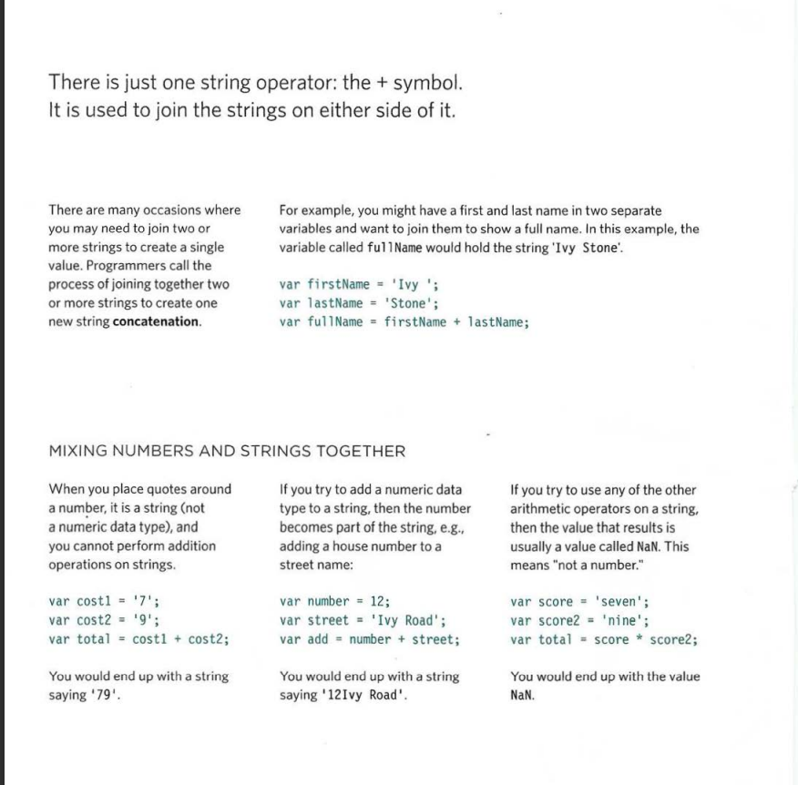
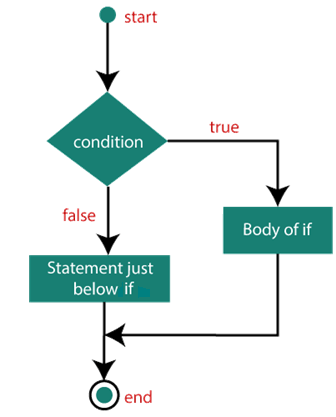

## Text :
### When creating a web page, you add tags (known as markup) to the contents of the page. These tags provide extra meaning and allow browsers to show users theappropriate structure for the page.

* ### Headings :
* ### HTML has six "levels" of headings:
+ ### <h1> : is used for main headings
+ ### <h2> : is used for subheadings
+ ### <h3> : If there are further sections under the subheadings then the element is used, and so on...
+ ### <h4>
+ ### <h5>
+ ### <h6>

* ### Paragraphs :
+ ### 
 : To create a paragraph, surround the words that make up the paragraph with an opening 
 tag and closing 
 tag.

* ### Bold & Italic :
* ### "<b>" : By enclosing words in the tags <b> and </b> we can make characters appear bold.
* ### "<i>" : By enclosing words in the tags <i> and </i> we can make characters appear italic.

* ### Superscript and Subscript :
+ ### "" : The  element is used to contain characters that should be superscript such as the suffixes of dates or mathematical concepts like raising a number to a power.

+ ### "" : The  element is used to contain characters that should be subscript. It is commonly used with foot notes or chemical formulas such as H20.

* ### White Space :
+ ### In order to make code easier to read, web page authors often add extra spaces or start some elements on new lines.
+ ### When the browser comes across two or more spaces next to each other, it only displays one space. Similarly if it comes across a line break, it treats that as a single space too. This is known as white space collapsing.

* ### Line Breaks & Horizontal Rules :
+ ### " " : As you have already seen, thebrowser will automatically show each new paragraph or heading on a new line. But if you wanted to add a line break inside the middle of a paragraph you can use the line break tag " ".
+ ### "
" : To create a break between themes — such as a change of topic in a book or a new scene in a play — you can add a horizontal rule between sections using the "
" tag.

* ### Semantic Markup :
+ ### Strong & Emphasis : <strong> : The use of the <strong> element indicates that its content has strong importance. For example, the words contained in this element might be said with strong emphasis. By default, browsers will show the contents of a <strong> element in bold.

+ ### "<em>" : The "<em>" element indicates emphasis that subtly changes the meaning of a sentence. By default browsers will show the contents of an "<em>" element in italic.

 * ### Quotations :

 + ### "<blockquote>" : The <blockquote> element is used for longer quotes that take up an entire paragraph. Note how the "
" element is still used inside the <blockquote> element.
 + ### "<q>" : The "<q>" element is used forshorter quotes that sit within a paragraph. Browsers are supposed to put quotes around the <q> element, however Internet Explorer does not — therefore many people avoid using the "<q>" element.
 + ### "<abbr>" : If you use an abbreviation or an acronym, then the "<abbr>" element can be used. A title attribute on the opening tag is used to specify the full term.

* ### Citations & Definitions Author Details ,and Changes to Content.(read more about in Duckett HTML and CSS book pages 54-56).

* ## Conclusion :
+ ### HTML elements are used to describe the structure of the page (e.g. headings, subheadings, paragraphs).
+ ### They also provide semantic information (e.g. where emphasis should be placed, the definition of any acronyms used, when given text is a quotation).

* ## Css Introduction :

#### CSS allows you to create rules that specify how the content of an element should appear. For example, you can specify that the background of the page is cream, all paragraphs should appear in gray using the Arial typeface, or that all level one headings should be in a blue, italic, Times typeface.
### Understanding CSS: Thinking Inside the Box.
### The key to understanding how CSS works is to imagine that there is an invisible box around every HTML element.

### BLOCK & INLINE ELEMENTS:
### There is a difference between block level and inline elements and how browsers display them.
### •	Block level elements look like they start on a new line.
### Examples include the <h1>- <h6>, 
 and 
 elements.
### •	Inline elements flow within the text and do not start on a newline.
### Examples include "<b>", "<i>", "", "<em>" and "".
### CSS allows you to create rules that control the way that each individual box (and the contents of that box) is presented.

* ### CSS Associates Style rules with HTML elements
### P {
### Font-family: Arial;}
### P is called selector. 
## Font-family: Arial;} : is called decleration.
### This rule indicates that all 
 elements should be shown in the Arial typeface.

* ### Selectors indicate which element the rule applies to. The same rule can apply to more than one element if you separate the element names with commas.

* ### Declarations indicate how the elements referred to in the selector should be styled. Declarations are split into two parts (a property and a value), and are separated by a colon

### CSS Properties Affect How Elements Are Displayed

### h1, h2, h3 {
###  font-family: Arial;
### color: yellow;}

### This rule indicates that all <h1>,<h2> and <h3> elementsshould be shown in the Arial typeface, in a yellow color.

### Properties indicate the aspects of the element you want to change. For example, color, font, width, height and border.

### Values specify the settings you want to use for the chosen properties. For example, if you want to specify a color property then the value is the color you want the text in these elements to be.

* ### Using External CSS
### <link>

### The element can be used in an HTML document to tell the browser where to find the CSS file used to style the page. It is an empty element (meaning it does not need a closing tag), and it lives inside the element. It should use three attributes:
### •	herf : This specifies the path to the CSS file (which is often placed in a folder called css or styles)
### •	type : This attribute specifies the type of document being linked to. The value should be text/css.
### •	rel : This specifies the relationship between the HTML page and the file it is linked to. The value should be stylesheet when linking to a CSS file.

* ### An HTML page can use more than one CSS style sheet. To do this it could have a element for every CSS file it uses. For example, some authors use one CSS file to control the presentation (such as fonts and colors) and a second to control the layout.

* ### Using Internal CSS
* ### <style> :
### You can also include CSS rules within an HTML page by placing them inside a element of the page.The <style> element should use the type attribute to indicate that the styles are specified in CSS. The value should be text/css.

* ### CSS Selectors
### •	There are many different types of CSS selector that allow you to target rules to specific elements in an HTML document.
### •	CSS selectors are case sensitive, so they must match element names and attribute values exactly

* ### Universal Selector: Applies to all elements in the document: Example :* {} Targets all elements on the page.
* ### Type Selector: Matches element names: Example: h1, h2, h3 Targets the <h1>, <h2> and <h3>elements And many more examples in Duckett book Html and Css page 238.

* ### Why use External Style Sheets?

### •	All of your web pages can share the same style sheet. This is achieved by using the element on each HTML page of your site to link to the same CSS document. This means that the same code does not need to be repeated in every page (which results in less code and smaller HTML pages). Therefore, once the user has downloaded the CSS stylesheet, the rest of the site will load faster. If you want to make a change to how your site appears, you only need to edit the one CSS file and all of your pages will be updated. For example, you can change the style of every <h1> element by altering  the one CSS style sheet, rather than changing the CSS rules on every page. The HTML code will be easier to read and edit because it does not have lots of CSS rules in the same document. It is generally considered good practice to have the content of the site separated from the rules that determine how it appears.

## Conclusion:
### •	CSS treats each HTML element as if it appears inside its own box and uses rules to indicate how that element should look.
### •	 Rules are made up of selectors (that specify the elements the rule applies to) and declarations (that indicate what these elements should look like).
### •	 Different types of selectors allow you to target your rules at different elements. 
### •	 Declarations are made up of two parts: the properties of the element that you want to change, and the values of those properties. For example, the font-family property sets the choice of font, and the value arial specifies Arial as the preferred typeface. 
### •	 CSS rules usually appear in a separate document, although they may appear within an HTML page. 
 

## JS :

* ### STATEMENTS :
* ### A script is a series of instructions that a computer can follow one-by-one. Each individual instruction or step is known as a statement. Statements should end with a semicolon.
 * ### STATEMENTS ARE INSTRUCTIONS AND EACH ONE STARTS ON A NEW LINE.
 * ### STATEMENTS CAN BE ORGANIZED INTO CODE BLOCKS.

 * ### COMMENTS :
 * ### You should write comments to explain what your code does.They help make your code easier to read and understand.This can help you and others who read your code.
 * ### // we use this for single line comment .
 * ### /*  */ we use this for multi-line comment.

* ## WHAT IS A VARIABLE? 
* ### A script will have to temporarily store the bits of information it needs to do its job. It can store this data in variables.
* ### A variable is a good name for this concept because the data stored in a variable can change (or vary) each time a script runs. 
* ### How to declare a variable ? and how to assign them a value ?
* #### var "variable name" = "value";

* ### DATA TYPES :
* #### NUMERIC DATA TYPE : 4 , 5.5.
* #### STRING DATA TYPE : 'hi' , '5' .
* #### BOOLEAN DATA TYPE : true , false.
* #### There is also rules of naming a variable.

* ### ARRAYS :
* #### An array is a special type of variable. It doesn't just store one value; it stores a list of values.
* #### You should consider using an array whenever you are working with a list or a set of values that are related to each other.
* #### CREATING AN ARRAY : 
#### var colors;
1. #### colors ['white', 'black', ' custom'];
2. #### var colors = new Array('white ','black','custom');

* ### VALU ES IN ARRAYS : Values in an array are accessed as if they are in a numbered list. It is important to know that the numbering of this list starts at zero (not one).(more about arrays on page 72).

* ### EXPRESSIONS :
* ### An expression evaluates into (results in) a single value. Broadly speaking there are two types of expressions:
1. #### EXPRESSIONS THAT JUST ASSIGN A VALUE TO A VARIABLE. var color = 'beige';
2. #### EXPRESSIONS THAT USE TWO OR MORE VALUES TO RETURN A SINGLE VALUE. var area = 3 * 2;

* ### OPERATORS:
* ### Expressions rely on things called operators; they allow programmers to create a single value from one or more values.
1. #### ASSIGNMENT OPERATORS Assign a value to a variable
2. #### ARITHMETIC OPERATORS (+ , - , * ,++) Perform basic math , more details as shown in the figure.

3. #### STRING OPERATORS Combine two strings (greeting= 'Hi 1 + 'Mol ly';) The value of greeting is now Hi Molly.

4. ##### COMPARISON OPERATORS Compare two values and return true or false
5. ##### LOGICAL OPERATORS Combine expressions and return true or false

- ## Conclusion :
- ### A script is made up of a series of statements. Each statement is like a step in a recipe.
- ### Scripts contain very precise instructions. For example, you might specify that a value must be remembered before creating a calculation using that value.
- ### Variables are used to temporarily store pieces of information used in the script.
- ### Arrays are special types of variables that store more than one piece of related information.
- ### JavaScript distinguishes between numbers (0-9), strings (text), and Boolean values (true or false).
- ### Expressions evaluate into a single value.
- ### Expressions rely on operators to calculate a value.

- ## Decisions and Loops :
- ### There are several places inb a script where desicions are made that determin which lines of code should be run.

- ### Comparision Operators :
1. #### == is equal to
2. #### === strict equal to 
3. #### != is not equal to
4. #### !== strict not equal to
5. #### > grater than , < less than , >= grater than or equal to , <= less than or equal to 
* ### For maore about operators and examples (pages 151-156).

- ### Logical Operators :

1. #### && Logical and
2. #### || Logical or
3. #### ! Logical not

- ### if statements :

- #### The if statements evaluates or checks a condition.if the condition evaluates to true any statements in the subsequent code are excuted.

- ### if else statements :
- #### Checks a condition if it resolves to a true , the first code block is excuted , if the condition resolves to false the second code block is excuted.
***For more go to Duckett book pages 145-162***

