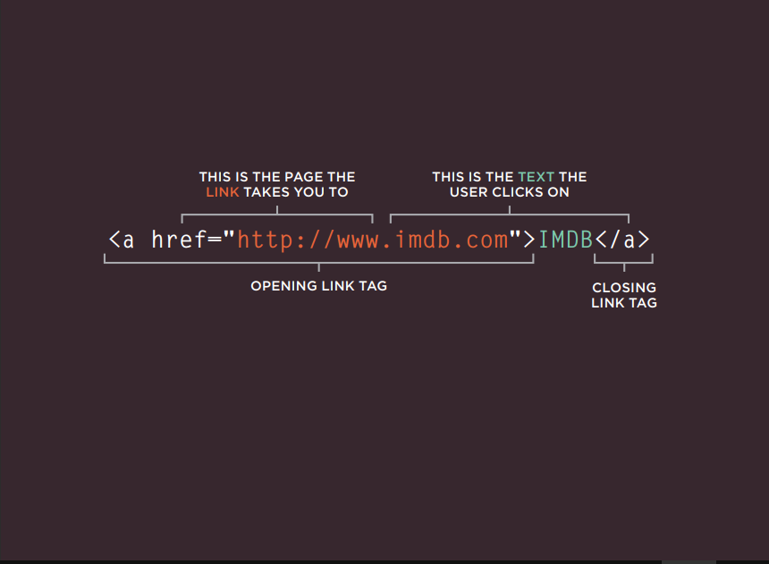

# Links :

## Links are the defining feature of the web because they allow you to move from one web page to another — enabling the very idea of browsing or surfing.

1. ## Writing Links:
- ### Links are created using the '<a>' element. Users can click on anything between the opening <a> tag and the closing '</a>' tag. You specify which page you want to link to using the href attribute.

2. ## Linking to Other Sites: '<a>'

- ### Links are created using the <a> element which has an attribute called href. The value of the href attribute is the page that you want people to go to when they click on the link. Users can click on anything that appears between the opening <a> tag and the closing </a> tag and will be taken to the page specified in the href attribute. When you link to a different website, the value of the href attribute will be the full web address for the site, which is known as an absolute URL.

  - ### Absolute URLs: URL stands for Uniform Resource Locator. Every webpage has its own URL. This is the web address that you would type into a browser if you wanted to visit that specific page.

  - ### An absolute URL starts with the domain name for that site, and can be followed by the path to a specific page. If no page is specified, the site will display the homepage.

  - ### Linking to Other Pages on the Same Site: When you are linking to other pages within the same site, you do not need to specify the domain name in the URL. You can use a shorthand known as a relative URL. If all the pages of the site are in the same folder, then the value of the href attribute is just the name of the file.

  - ### If you have different pages of a site in different folders, then you can use a slightly more complex syntax to indicate where the page is in relation to the current page. You will learn more about these on the pages 81-84.

3. ## Directory Structure : On larger websites it's a good idea to organize your code by placing the pages for each different section of the site into a new folder. Folders on a website are sometimes referred to as directories.

.png)

- ### Relative URLs : Relative URLs can be used when linking to pages within your own website. They provide a shorthand way of telling the browser where to find your files.

.png)

- ### Email Links : 'mailto:' To create a link that starts up the user's email program and addresses an email to a specified email address, you use the '<a>' element. However, this time the value of the href attribute starts with mailto: and is followed by the email address you want the email to be sent to.

 - ### Opening Links in a New Window : 'target' If you want a link to open in a new window, you can use the target attribute on the opening '<a>' tag. The value of this attribute should be '_blank'.

- ### Linking to a Specific Part of the Same Page : At the top of a long page you might want to add a list of contents that links to the corresponding sections lower down. Or you might want to adda link from part way down the page back to the top of it to save users from having to scroll back to the top.
 - ### Before you can link to a specific part of a page, you need to identify the points in the page that the link will go to. You do this using the id attribute ' (which can be used on every HTML element)'.
 - ### The value of the id attribute should start with a letter or an underscore (not a number or any other character) and, on a single page, no two id attributes should have the same value. To link to an element that uses an id attribute you use the '<a>' element again, but the value of the href attribute starts with the # symbol, followed by the value of the id attribute of the element you want to link to. 

- ### Linking to a Specific Part of Another Page : If you want to link to a specific part of a different page (whether on your own site or a different website) you can use a similar technique. As long as the page you are linking to has id attributes that identify specific parts of the page, you can simply add the same syntax to the end of the link for that page.Therefore, the href attribute   will contain the address for the page (either an absolute URL or a relative URL), followed by the  '#' symbol, followed by the value of the id attribute that is used on the element you are linking to.

__*for more about links please go to Duckett book p 74-93*__

# Layouts :

## Key Concepts in Positioning Elements :

- ### CSS treats each HTML element as if it is in its own box. This box will either be a block-level box or an inline box.
- ### Block-level elements : start on a new line '<h1> 
 <ul> <li>'.
- ### Inline elements : flow in between surrounding text ' <b> <i>'

- ### Containing Elements : If one block-level element sits inside another block-level element then the outer box is known as the containing or parent element.

- ### Controlling the Position of Elements :

 - ### Normal flow : 'position:static' In normal flow, each block-level element sits on top of the next one. Since this is the default way in which browsers treat HTML elements, you do not need a CSS property to indicate that elements should appear in normal flow, but the syntax would be: 'position: static;'.

 - ### Relative Positioning : 'position:relative' Relative positioning moves an element in relation to where it would have been in normal flow.

 - ### Absolute positioning: 'position:absolute' When the position property is given a value of absolute,the box is taken out of normal flow and no longer affects the position of other elements on the page. (They act like it is not there.

 - ### Fixed Positioning : 'position:fixed' Fixed positioning is a type of absolute positioning that requires the position property to have a value of fixed. It positions the element in relation to the browser window. Therefore, when a user scrolls down the page, it stays in the exact same place. It is a good idea to try this example in your browser to see the effect. To control where the fixed position box appears in relation to the browser window, the box offset properties are used.

 - ### Overlapping Elements : 'z-index' When you use relative, fixed, or absolute positioning, boxes can overlap. If boxes do overlap, the elements that appear later in the HTML code sit on top of those that are earlier in the page. If you want to control which element sits on top, you can use the z-index property. Its value is a number, and the higher the number the closer that element is to the front. For example, an element with a z-index of 10 will appear over the top of one with a z-index of 5.

  __*for more go to Duckett html book p 362-376*__

 - ### To indicate where a box should be positioned, you may also need to use box offset properties to tell the browser how far from the top or bottom and left or right it should be placed. (You will meet these when we introduce the positioning schemes on the following pages.)

- ## Screen Sizes : Different visitors to your site will have different sized screens that show different amounts of information, so your design needs to be able to work on a range of different sized screens.

- ## Screen Resolution : Resolution refers to the number of dots a screen shows per inch. Some devices have a higher resolution than desktop computers and most operating systems allow users to adjust the resolution of their screens.

- ### Page Sizes : Because screen sizes and display resolutions vary so much, web designers often try to create pages of around 960-1000 pixels wide (since most users will be able to see designs this wide on their screens).

- ## Fixed Width Layouts : Fixed width layout designs do not change size as the user increases or decreases the size of their browser window. Measurements tend to be given in pixels.
 __*Advantages and Disadvantages are on page 381*__

- ## Liquid Layouts : Liquid layout designs stretch and contract as the user increases or decreases the size of their browser window. They tend to use percentages. 
 __*Advantages and Disadvantages are on page 382*__

- ## Possible Layouts: 960 Pixel wide12 Column Grid

.png)

- ## Multiple Style Sheets : There are two ways to add multiple style sheets to a page :

 1. ### Your HTML page can link to one style sheet and that stylesheet can use the @import rule to import other style sheets. 
 __*If a styesheet uses the @import rule, it should appear before the other rules.*__

 2. ###  In the HTML you can use a separate '<link>' element for each style sheet.

## Conclusion : 

- ### '
' elements are often used as containing elements to group together sections of a page.

- ### Browsers display pages in normal flow unless you specify relative, absolute, or fixed positioning.

- ### The float property moves content to the left or right of the page and can be used to create multi-column layouts. (Floated items require a defined width.)

- ### Pages can be fixed width or liquid (stretchy) layouts.

- ### Designers keep pages within 960-1000 pixels wide, and indicate what the site is about within the top 600 pixels (to demonstrate its relevance without scrolling).

- ### Grids help create professional and flexible designs.

- ### CSS Frameworks provide rules for common tasks.

- ### You can include multiple CSS files in one page.

# JS : 

## Functions, Methods, and Objects :

- ## JavaScript: Functions, methods, and objects :

### Browsers require very detailed instructions about what we want them to do. Therefore, complex scripts can run to hundreds (even thousands) of lines. Programmers use functions, methods, and objects to organize their code.

- ### WHAT IS A FUNCTION?

### Functions let you group a series of statements together to perform a specific task. If different parts of a script repeat the same task, you can reuse the function (rather than repeating the same set of statements).

### the statements in a function are not always executed when a page loads, so functions also offer a way to store the steps needed to achieve a task. The script can then ask the function to perform all of those steps as and when they are required.

### If you are going to ask the function to perform its task later, you need to give your function a name. That name should describe the task it is performing. When you ask it to perform its task, it is known as calling the function.

### Parameters : Pieces of information passed to a function.

### When you write a function and you expect it to provide you with an answer, the response is  known as a return value.

### Declaring a function : 

'''Function  sayhello() {
Document.write(‘hello’);
}
Function : function keyword
sayhello() : function name
{ Document.write(‘hello’);}'''

### Calling functions (duckett book js page 91)

- ### Declaring a function that needs information (duckett book js page 92)
- ### Calling a function that needs information and the difference between arguments , parameters and values (duckett book js page 93)
- ### Getting a single and multiple values out of a function (page 94 & 95)

- ### ANONYMOUS FUNCTIONS & FUNCTION EXPRESSIONS : 

 - ### Expressions produce a value. They can be used where values are expected. If a function is placed where a browser expects to see an expression, (e.g., as an argument to a function), then it gets treated as an expression. 

 1. ### FUNCTION DECLARATION : A function declaration creates a function that you can call later in your code.

 - ### In order to call the function later in your code, you must give it a name, so these are known as named functions.

 2. ### FUNCTION EXPRESSION :
 - ### If you put a function where the interpreter would expect to see an expression, then it is treated as an expression, and it is known as a function expression. In function expressions, the name is usually omitted.A function with no name is called an anonymous function.

 3. ### IMMEDIATELY INVOKED FUNCTION EXPRESSIONS : This way of writing a function is used in several different situations. Often functions are used to ensure that the variable names do not conflict with each other (especially if the page uses more than one script).

 - ### IMMEDIATELY INVOKED FUNCTION EXPRESSIONS (llFE) : Pronounced "iffy," these functions are not given a name. Instead, they are executed once as the interpreter comes across them. 

 - ### WHEN TO USE ANONYMOUS FUNCTIONS AND llFES : They are used for code that only needs to run once within a task, rather than repeatedly being called by other parts of the script.

4. ### VARIABLE SCOPE : The location where you declare a variable will affect where it can be used within your code. If you declare it within a function, it can only be used within that function. This is known as the variable's scope.

 1. ### LOCAL VARIABLES : When a variable is created inside a function using the var keyword, it can only be used in that function. It is called a local variable or function-level variable. It is said to have local scope or function-level scope. It cannot be accessed outside of the function in which it was declared.

 2. ### GLOBAL VARIABLES : If you create a variable outside of a function, then it can be used anywhere within the script. It is called a global variable and has global scope.

## HOW MEMORY & VARIABLES WORK :  Global variables use more memory. The browser has to remember them for as long as the web page using them is loaded. Local variables are only remembered during the period of time that a function is being executed.

- ### CREATING THE VARIABLES IN CODE : Each variable that you declare takes up memory. The more variables a browser has to remember, the more memory your script requires to run. Scripts that require a lot of memory can perform slower, which in turn makes your web page take longer to respond to the user.

- ### NAMING COLLISIONS : You might think you would avoid naming collisions; after all you know which variables you are using. But many sites use scripts written by several people. If an HTML page uses two JavaScript files, and both have a global variable with the same name, it can cause errors.
__*more about this in duckett js book p 86-99*__

## Pair Programming : 

### How does pair programming work? 
 - #### While there are many different styles, pair programming commonly involves two roles: the Driver and the Navigator. The Driver is the programmer who is typing and the only one whose hands are on the keyboard. Handling the “mechanics” of coding, the Driver manages the text editor, switching files, version control, and—of course writing—code. The Navigator uses their words to guide the Driver but does not provide any direct input to the computer. The Navigator thinks about the big picture, what comes next, how an algorithm might be converted in to code, while scanning for typos or bugs. The Navigator might also utilize their computer as a second screen to look up solutions and documentation, but should not be writing any code.

### Why pair program?
- #### While learning to code, developers likely study several programming languages. Similar to a foreign language class, there are four fundamental skills that help anyone learn a new language: Listening: hearing and interpreting the vocabulary Speaking: using the correct words to communicate an idea Reading: understanding what written language intends to convey Writing: producing from scratch a meaningful.Pair programming touches on all four skills: developers explain out loud what the code should do, listen to others’ guidance, read code that others have written, and write code themselves.

 1. ### Greater efficiency

 2. ### Engaged collaboration

 3. ### Learning from fellow students

 4. ### 4. Social skills

 5. ### Job interview readiness

 6. ### Work environment readiness

__*For more please visit [link](https://www.codefellows.org/blog/6-reasons-for-pair-programming/)*__

